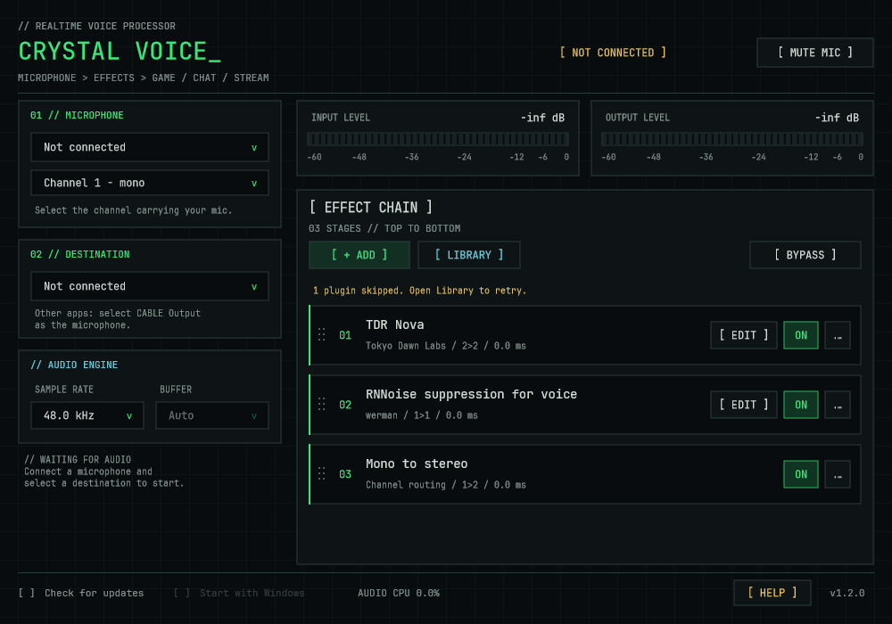

# Crystal Voice

A small Windows VST3 host for a better microphone in games, calls and streams.

**Microphone → effects → virtual audio cable → your application**

Crystal Voice is a fork of [MicVST](https://github.com/philipz794/MicVST). It keeps the native C++/JUCE audio engine and portable executable, with a redesigned interface and fixes to routing, plugin restoration and settings persistence.



The screenshot is rendered from the real application components with an isolated, disconnected test profile. Plugin names and saved settings in it come from an example chain; third-party plugins are not bundled.

## Use it

1. Install a virtual audio cable, such as [VB-CABLE](https://vb-audio.com/Cable/).
2. Run `CrystalVoice.exe`. Choose your physical **Microphone**, then choose **CABLE Input** as the destination. For an audio interface, select the correct physical input channel below the microphone.
3. Click **[ + ADD ]**. Search VST3 effects by name or manufacturer; press Enter or click Add. Use **[ EDIT ]** to edit a plugin, **ON/OFF** to enable it, and the grip or row menu to reorder it. While dragging, other effects animate out of the way; hovering at the list edge scrolls it. Escape cancels a drag, and the audio chain changes only on drop.
4. In the game, chat or streaming application, select **CABLE Output** as the microphone.

**[ MUTE MIC ]** silences the outgoing signal. **[ BYPASS ]** sends the dry microphone for comparison. Closing the window keeps audio running in the tray; right-click the tray icon to quit. Enable **Start with Windows** after placing the executable in a permanent folder.

RNNoise needs **48 kHz**. The device panel exposes supported sample rates and buffer sizes, shows errors inline and offers Retry. Reported latency is an estimate of the host path; the cable, receiving application and network add their own delay.

Both level bars and their numerical readings use VU-style average detection with about 300 ms to reach 99% of a steady level. The existing dBFS scale stays in place; the thin line separately holds sample peaks for 500 ms, then falls at 20 dB/s. Hover over a number to see the peak dBFS. Peaks at or above 0 dBFS turn red and remain visible inside the right border. These are sample peaks, without oversampled true-peak detection.

**[ LIBRARY ] → Automatic scan folders** lists the folders scanned automatically and marks those that are installed. These include the [standard VST3 locations](https://steinbergmedia.github.io/vst3_dev_portal/pages/Technical%2BDocumentation/Locations%2BFormat/Plugin%2BLocations.html), the portable executable's `VST3` subfolder, semicolon-separated `VST3_PATH` entries, and common `VSTPlugins`, `Steinberg/VstPlugins`, `Common Files/VST2` and `Common Files/Steinberg/VST2` directories described by [Steinberg](https://helpcenter.steinberg.de/hc/en-us/articles/115000177084-VST-plug-in-locations-on-Windows). Only `.vst3` effects are discovered in those directories; VST2 `.dll` plugins are not supported. Use **Add VST3 folder** for other locations.

## What changed from MicVST

- A console interface inspired by threshold-34: black surfaces, green/cyan accents, square panels, an integrated title bar and embedded JetBrains Mono Regular/Medium. Routing stays on the left; segmented input/output meters and effects stay on the right. The backdrop is static.
- Mono channel 1, mono channel 2 or stereo input selection. Mono audio fans out to stereo destinations automatically; auxiliary sidechain buses are excluded from the voice route.
- Cable discovery no longer switches the current audio device. Failed changes preserve the previous requested route and WASAPI mode. Hot-unplug keeps the selected device names instead of saving a fallback. Runtime driver errors reach the UI safely; old errors are discarded after a restart. Low-latency open failures retry the same endpoints in shared mode.
- Missing or failed effects stay in their original positions with preset data preserved. Already cached effects can be used while scanning continues. The effect picker updates with the library and retains its search and selected VST3 class.
- VST3 class identifiers are saved, including multiple effects inside the same bundle. Bundle/binary cache aliases no longer cause a scan on every launch.
- Row actions use stable effect identities and safe callbacks. A plugin has one editor window; closing it saves its parameters. Plugins without a custom editor can use the generic parameter editor.
- Settings and the scan cache are written atomically. A valid previous settings file is kept as `config.xml.bak` and used if the main file is damaged.
- Meters follow window visibility, including first launch and returning from the tray, and stop refreshing when hidden. Startup registry reads happen once per second while visible, rather than every meter frame.
- The fork has its own config folder, startup entry and update source. It imports an existing MicVST setup on first normal launch without changing the original files.

## Build and test

Requires Windows x64, CMake 3.22 or newer, and Visual Studio 2022 Build Tools with the C++ workload and Windows SDK. CMake fetches JUCE **8.0.13**.

```powershell
cmake -S . -B build -G "Visual Studio 17 2022" -A x64
cmake --build build --config Release --target CrystalVoice MicVSTTests --parallel 6
ctest --test-dir build -C Release --output-on-failure
```

Portable binary: `build/CrystalVoice_artefacts/Release/CrystalVoice.exe`. The static MSVC runtime avoids a Visual C++ Redistributable dependency.

Regression tests cover audio graph processing, scanning and cache invalidation, missing-plugin restoration, device restart/mode fallback and rollback, settings recovery, VST3 identity, row reordering and live picker interactions. Engine tests use in-memory devices with WASAPI disabled, so they do not open real audio endpoints. Windows CI runs the same Release build and tests; tag releases are published only after tests pass.

See [validation results and remaining manual checks](docs/validation.md) for the local hardware smoke test and resource measurements.

### Isolated development profiles

```powershell
.\build\CrystalVoice_artefacts\Release\CrystalVoice.exe --profile C:\Temp\CrystalVoiceTest
```

An explicit profile uses its own settings and disables startup changes. To render documentation from the application's own components without screen capture or desktop interaction, provide an existing disconnected profile:

```powershell
.\build\CrystalVoice_artefacts\Release\CrystalVoice.exe --profile C:\Temp\CrystalVoiceTest --render-preview C:\Temp\CrystalVoice.png
```

Icons are defined in `resources/crystal-voice.svg`. Regenerate the Windows application and tray PNGs with `tools/Generate-Icons.ps1`.

## Settings and compatibility

Normal settings live in `%APPDATA%\CrystalVoice`; the startup registry entry is `CrystalVoice`. On first launch, a valid `%APPDATA%\MicVST\config.xml` and plugin cache can be imported. The original MicVST installation and settings remain intact. Close the old host before running both hosts into the same virtual cable.

Only **VST3 effects** are supported. Plugins and virtual cable drivers must be installed separately. The application is unsigned; releases include a SHA-256 checksum. Windows 11 x64 is the development platform; Windows 10 compatibility and manual device hotplug testing still need broader verification.

## License

GNU GPL v3.0; see [LICENSE](LICENSE). Original MicVST copyright (C) 2026 Philip Zimmermann. This fork retains the original attribution and license. JUCE, plugins and virtual cable software are subject to their own licenses.

The bundled [JetBrains Mono](https://github.com/JetBrains/JetBrainsMono) fonts use the [SIL Open Font License 1.1](resources/fonts/OFL.txt). See [font provenance](resources/fonts/README.md); the license is embedded and readable in Help.
